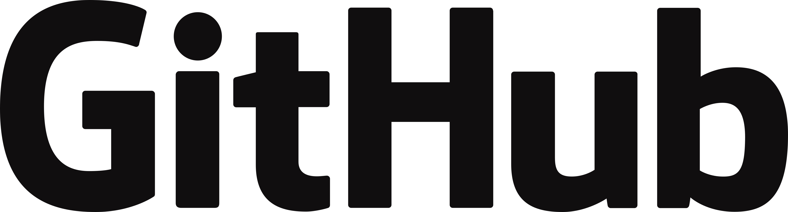

<svg fill="none" viewBox="0 0 0 0" width="0" height="0" xmlns="http://www.w3.org/2000/svg">
  
  <foreignObject width="100%" height="100%">
    <div xmlns="http://www.w3.org/1999/xhtml">
      <style>
      .custom_centralize_img {
        border: 5px solid #555;
        display: block;
        height:50%;
        margin: 0 auto;
        margin-bottom:15px;
        margin-top:15px;
        width:25%;
      }
      .cards_div_main {
        align-items: center;
        display: flex;
        justify-content: center;
        padding: 10px;
        text-align: center;
      }
      .cards_div_child {
        float: left;
        margin: 0 auto;
        margin-bottom:15px;
        margin-top:15px;
        text-align: middle;
        width: 40%;
      }
      .blink_me {
        animation: blinker 1s linear infinite;
      }
      @keyframes blinker {
        50% {
          opacity: 0;
        }
      }
      </style>
    </div>
  </foreignObject>
</svg>

# Nome do projeto

<!-- Esses são exemplos. Veja https://shields.io para outras pessoas ou para personalizar este conjunto de escudos. Você pode querer incluir dependências, status do projeto e informações de licença usando esse link. -->


#### 👆 Para um exemplo bacana e prático de como ficam os escudos/badges (exemplo acima) aplicados ao repositório, segue o tutorial: 👉 https://github.com/iuricode/README-template/blob/main/README-repository/iuricode.md

<div align="center">
  
</div>

## 📋 Introdução ou Descrição

Linha adicional de texto informativo sobre o que o projeto faz. Sua introdução deve ter cerca de 2 ou 3 linhas. Não exagere, as pessoas tendem a ignorar conteúdos longos.

## 💻 Pré-requisitos

Antes de começar, verifique se você atendeu aos seguintes requisitos:
<!-- Estes são apenas requisitos de exemplo. Adicionar, duplicar ou remover conforme necessário. -->
* Você instalou a versão mais recente de `<linguagem / dependência / requeridos>`
* Você tem uma máquina `<Windows / Linux / Mac>`. Indique qual sistema operacional é compatível / não compatível.
* Você leu `<guia / link / documentação_relacionada_ao_projeto>`.

## 🚀 Instalando dependências

Para instalar as dependências do <nome_do_projeto>, siga a(s) instrução/instruções abaixo:

Linux e macOS:
```
<comando_de_instalação>
```

Windows:
```
<comando_de_instalação>
```

## ☕ Como usar o <nome_do_projeto>

Para usar <nome_do_projeto>, siga estas etapas:

```
<exemplo_de_uso>
```

Adicione comandos de execução e exemplos que você acha que os usuários acharão úteis. Fornece uma referência de opções para pontos de bônus!

## 📫 Contribuindo para o <nome_do_projeto>
<!-- Se o seu README for longo ou se você tiver algum processo ou etapas específicas que deseja que os contribuidores sigam, considere a criação de um arquivo CONTRIBUTING.md separado. -->
Para contribuir com <nome_do_projeto>, siga estas etapas:

1. Bifurque este repositório.
2. Crie um branch: `git checkout -b <nome_branch>`.
3. Faça suas alterações e confirme-as: `git commit -m '<mensagem_commit>'`
4. Envie para o branch original: `git push origin <nome_do_projeto> / <local>`
5. Crie a solicitação de pull.

Como alternativa, consulte a documentação do GitHub em [como criar uma solicitação pull](https://help.github.com/en/github/collaborating-with-issues-and-pull-requests/creating-a-pull-request).

## 🤝 Contribuidores / Mantenedores

Agradecemos às seguintes pessoas que contribuíram para este projeto:

<table>
  <tr>
    <td valign="middle" align="center">
      <a href="#">
        
        <br>
        <sub>
          <b>Nome e Sobrenome</b>
        </sub>
      </a>
    </td>
    <td valign="middle" align="center">
      <a href="#">
        
        <br>
        <sub>
          <b>Mark Zuckerberg</b>
        </sub>
      </a>
    </td>
    <td valign="middle" align="center">
      <a href="#">
        
        <br>
        <sub>
          <b>Steve Jobs</b>
        </sub>
      </a>
    </td>
  </tr>
</table>

## 😄 Seja um dos contribuidores

Quer fazer parte desse projeto? Clique [AQUI](CONTRIBUTING.md) e leia como contribuir.

## 📝 Licença

Esse projeto está sob licença. Veja o arquivo [LICENÇA](LICENSE.md) para mais detalhes.

<div class="cards_div_main">
  <div class="cards_div_child">
  <!-- É necessário manter o pulo de linha para que o link funcione dentro de uma tag. -->
  
  [](https://github.com/quan-to/)
  </div>
  <div class="cards_div_child">
  <!-- É necessário manter o pulo de linha para que o link funcione dentro de uma tag. -->

  [](https://github.com/quan-to/)
  </div>
</div>

<div class="blink_me">
  <!-- É necessário manter o pulo de linha para que o link funcione dentro de uma tag. -->

  [⬆ Voltar ao topo](#nome-do-projeto)
</div>